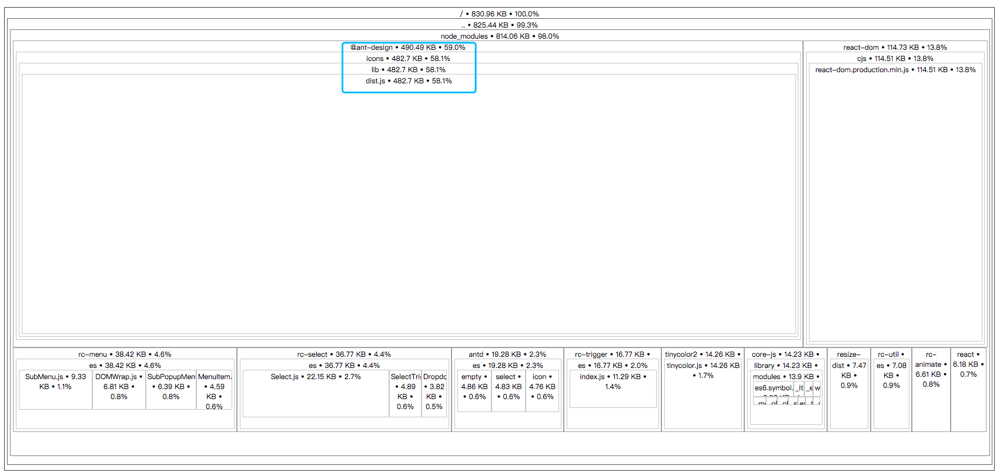
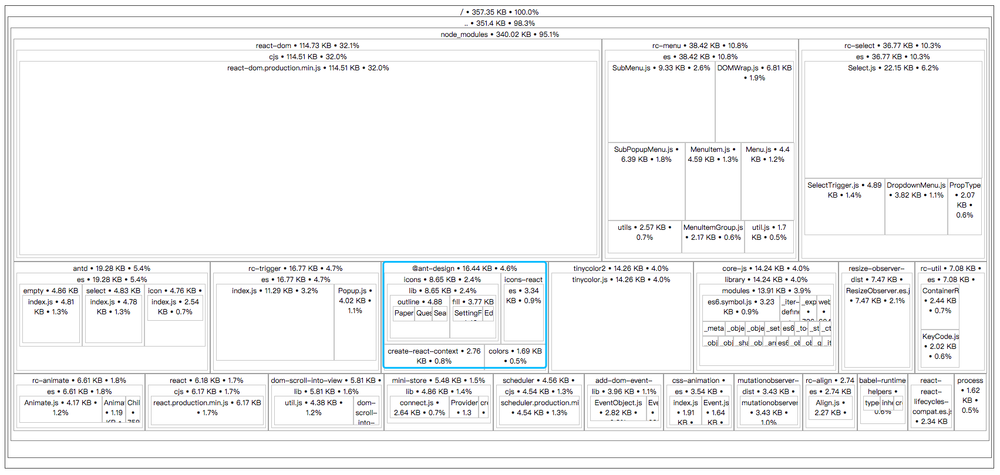
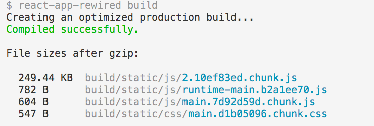
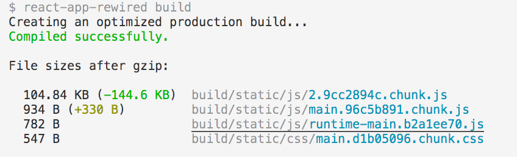
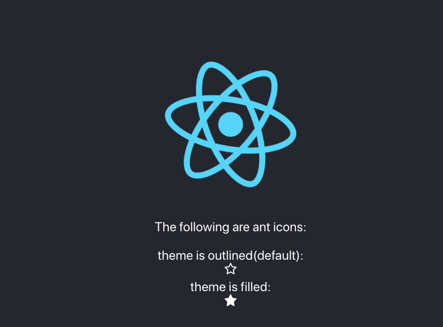

## 1. Issure: Antd adds antd-icons which increases bundle size a lot

See related issue:[Antd v3.9.0 adds antd-icons which increases bundle size a lot](https://github.com/ant-design/babel-plugin-import/issues/271).

## 2. Optimization Target: Reduce Antd icons bundle size(Load Antd icons on demand)

## 3. Optimization Steps
### 3.1. Add Webpack Config
```js
// create-react-app config-overrides.js
const { override, fixBabelImports } = require('customize-cra');
const path = require('path');

module.exports = override(
  fixBabelImports('import', {
    libraryName: 'antd',
    libraryDirectory: 'es',
    style: true
  }),

  function(config, env) {
    const alias = config.resolve.alias || {};
    alias['@ant-design/icons/lib/dist$'] = path.resolve(__dirname, './src/icons/index.js');
    config.resolve.alias = alias;
    return config;
  }
)
```
### 3.2. Add icons/index.js(export Icon Component on demand)
See the whole file [src/icons/index.js](./src/icons/index.js)
```js
// src/icons/index.js

/**
 * List all antd icons you want to use in your source code
 */
export {

  // star
  default as StarFill
} from '@ant-design/icons/lib/fill/StarFill';

export {

  // star
  default as StarOutline
} from '@ant-design/icons/lib/outline/StarOutline';

// other icons...
```

``note``: Cross-References(Quick Search)

Icon Component <=> Icon type
```js
// src/icons/component_map_type.txt(copy from the node_moudes/antd/dist/antd.js)
// Theme is Filled
exports.AccountBookFill = getIcon('account-book', fill, getNode(newViewBox, ...));
exports.AlertFill = getIcon('alert', fill, getNode(newViewBox, ...));
exports.AliwangwangFill = getIcon('aliwangwang', fill, getNode(newViewBox, ...));
exports.AlipayCircleFill = getIcon('alipay-circle', fill, getNode(newViewBox, ...));
...

// Theme is Outlined
exports.AccountBookOutline = getIcon('account-book', outline, getNode(newViewBox, ...));
exports.AlertOutline = getIcon('alert', outline, getNode(newViewBox, ...));
exports.AliwangwangOutline = getIcon('aliwangwang', outline, getNode(newViewBox, ...));
exports.AlipayCircleOutline = getIcon('alipay-circle', outline, getNode(newViewBox, ...));
...

// Theme Two Tone
...

```

## 3.3. Optimization Results
| Before Optimization| After Optimization|
|:----:|:----:|
| | |
| | |
## 4. Usage
### 4.1. Code
```js
// src/App.js
import React from 'react';
import logo from './logo.svg';
import './App.css';
import { Icon } from 'antd';

function App() {
  return (
    <div className="App">
      <header className="App-header">
        
        <p>The following are ant icons:</p>
        theme is outlined(default): <Icon type='star'/>
        theme is filled: <Icon type="star" theme="filled" />
      </header>
    </div>
  );
}

export default App;
```
### 4.2. Page Result


## 4.3. More
[Ant-Design Icon document](https://ant.design/components/icon/)

## 5. Reference
[Let’s Make Our Bundle Size Even Smaller](https://hackernoon.com/lets-make-our-bundle-size-even-smaller-7a5727bb110)

[source-map-explorer](https://github.com/danvk/source-map-explorer#readme)

[reduce-antd-icons-bundle-demo](https://github.com/HeskeyBaozi/reduce-antd-icons-bundle-demo)
